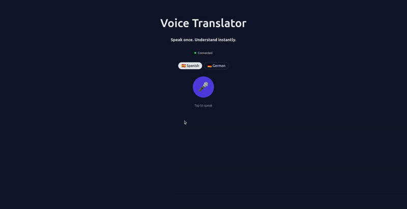

# Voice Translator - Real-time Speech to Translation

A modern web application that records user voice input and translates spoken sentences in real-time using WebSocket communication.



## Features

✨ **Real-time Voice Recording**: Uses Web Speech API to convert spoken words to text in real-time  
✨ **Live Translation**: Sends transcribed text to backend via Socket.io for instant translation  
✨ **Multiple Languages**: Supports English to Spanish and German translations  
✨ **Beautiful UI**: Clean, responsive interface built with React and CSS  
✨ **Connection Status**: Real-time server connection indicator  
✨ **Translation History**: View all past translations in a scrollable list  

## Project Structure

```
numeo/
├── backend/
│   ├── server.js              # Node.js server with Socket.io
│   ├── socketHandlers.js      # Socket event handlers
│   ├── translations.json      # Mock translation database
│   ├── .env                   # Backend environment variables
│   ├── .env.example           # Environment template
│   ├── package.json
│   └── package-lock.json
└── frontend/
    ├── src/
    │   ├── App.tsx            # App shell wiring components
    │   ├── App.css            # Base layout + global styles
    │   ├── index.css          # Global styles + resets
    │   ├── socket.ts          # Socket.io client utility
    │   ├── types/             # Shared TypeScript types
    │   │   ├── index.ts
    │   │   ├── translation.ts
    │   │   └── voiceRecording.ts
    │   ├── components/
    │   │   ├── AppHeader.tsx
    │   │   ├── ErrorBanner.tsx
    │   │   ├── LanguageSwitch.tsx
    │   │   ├── MicControls.tsx
    │   │   ├── TranscriptCard.tsx
    │   │   └── TranslationHistory.tsx
    │   ├── hooks/
    │   │   └── useVoiceRecording.ts  # Web Speech API hook
    │   ├── main.tsx
    │   └── vite-env.d.ts
    ├── public/
    ├── package.json
    ├── vite.config.ts
    └── tsconfig.json
```

## Technology Stack

### Backend
- **Node.js**: JavaScript runtime
- **Socket.io**: Real-time bidirectional communication

### Frontend
- **React 19**: UI framework
- **TypeScript**: Type safety
- **Vite**: Build tool and dev server
- **Socket.io-client**: WebSocket client library

### APIs
- **Web Speech API**: Browser's native speech recognition

## Getting Started

### Prerequisites
- Node.js (v14 or higher)
- npm or yarn
- Modern web browser with Web Speech API support

### Installation

1. **Backend Setup**
```bash
cd backend
npm install
```

2. **Frontend Setup**
```bash
cd frontend
npm install
```

### Running the Application

1. **Start the Backend Server**
```bash
cd backend
node server.js
# Server will run on http://localhost:3002
```

2. **Start the Frontend Development Server** (in a new terminal)
```bash
cd frontend
npm run dev
# Frontend will be available at http://localhost:5173
```

3. **Open in Browser**
Navigate to `http://localhost:5173` in your web browser.

## How to Use

1. **Select Target Language**: Choose between Spanish or German
2. **Start Recording**: Click the "🎤 Start Recording" button
3. **Speak Naturally**: Say a sentence (must be one of the predefined phrases for this demo)
4. **Stop Recording**: Click the "⏹️ Stop Recording" button
5. **View Translation**: The translation appears automatically in the translations history

### Predefined Phrases (for demo)

The backend has a mock database with translations for these English phrases:
- "hello world"
- "how are you"
- "good morning"
- "thank you very much"
- "what is your name"
- "nice to meet you"
- "where is the bathroom"
- "i love this place"
- "can you help me"
- "see you later"

## Architecture

### Real-time Communication Flow

```
User speaks
    ↓
Web Speech API converts audio to text
    ↓
Transcript sent via Socket.io
    ↓
Backend receives text
    ↓
Backend looks up translation in mock database
    ↓
Translation sent back via Socket.io
    ↓
UI updates with translation instantly
```

## API Reference

### Socket.io Events

**Client → Server:**
- `translate` - Send text for translation
  ```typescript
  socket.emit('translate', { 
    text: string, 
    targetLanguage: 'spanish' | 'german' 
  })
  ```

**Server → Client:**
- `translation` - Receive translation result
  ```typescript
  socket.on('translation', (data) => {
    // data: { original, translated, targetLanguage, status }
  })
  ```

## Browser Support

- Chrome/Edge: Full support
- Firefox: Full support
- Safari: Full support (iOS 14.5+)
- Opera: Full support

Note: Web Speech API availability varies by browser and may require HTTPS in production.

## Development

### Build for Production

**Frontend:**
```bash
cd frontend
npm run build
```

**Backend:**
The backend is already production-ready with Node.js.

## Features & Customization

### Adding New Translations

Edit `backend/translations.json` to add more phrase translations:

```json
{
  "english": "your phrase",
  "spanish": "tu frase",
  "german": "dein satz"
}
```

### Changing Ports

- **Backend**: Set `PORT` in `backend/.env`
- **Frontend**: Vite automatically detects available ports or modify `vite.config.ts`
- **Socket.io URL**: Update `http://localhost:3002` in `frontend/src/socket.ts`
 - **CORS origin**: Set `CLIENT_ORIGIN` in `backend/.env`

### Styling

Styling is handled with standard CSS in `src/App.css` and `src/index.css`.

## Troubleshooting

### Connection Failed
- Ensure backend server is running on port 3002
- Check browser console for errors (F12 → Console)
- Verify Socket.io URL in `socket.ts` matches backend PORT

### Microphone Permission Denied
- Allow microphone access when browser prompts
- Check browser settings for microphone permissions
- Some browsers require HTTPS for microphone access

### No Translations Returned
- Ensure your spoken phrase matches one in `translations.json`
- Try phrases exactly as listed (case-insensitive matching)
- Check backend console for debug logs

### Port Already in Use
- Backend: Change `PORT` in `backend/.env`
- Frontend: Vite will automatically use next available port

## Future Enhancements

- [ ] Integration with actual AI translation APIs (Google Translate, OpenAI, DeepL)
- [ ] Real speech-to-text API integration (Google Cloud Speech-to-Text, Azure Speech Services)
- [ ] Support for more languages
- [ ] User authentication and history persistence
- [ ] Audio playback of translations
- [ ] Offline mode with cached translations
- [ ] Language detection from speech
- [ ] Improved error handling and retry logic

## License

MIT License - Feel free to use this project for personal or commercial purposes.

## Contributing

Contributions are welcome! Feel free to submit issues and enhancement requests.

---

**Happy translating! 🎤🌍**
